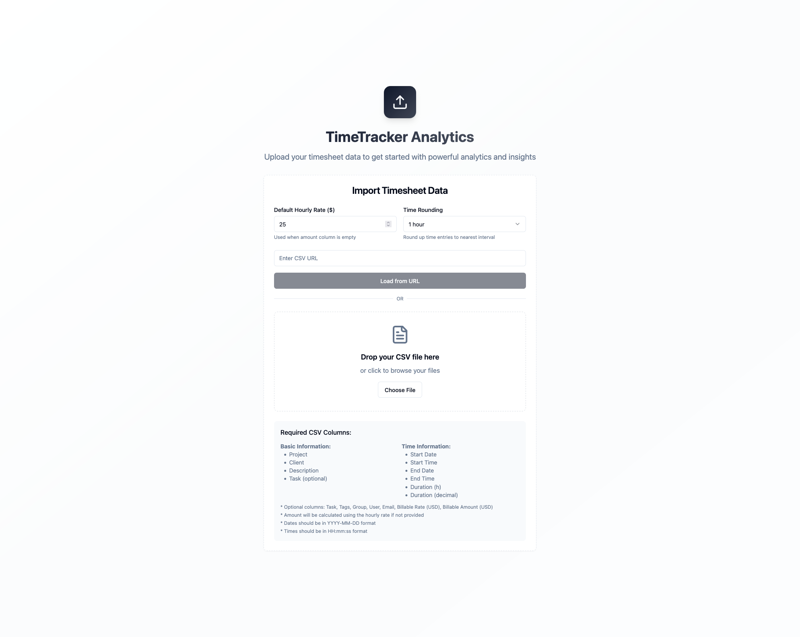

# ⏱️ TimeTracker Analytics

> Transform your timesheet data into actionable insights with powerful analytics and beautiful visualizations.

[](https://www.typescriptlang.org/)
[](https://reactjs.org/)
[](https://tailwindcss.com/)
[](https://vitejs.dev/)



## 🌟 Features

### 📥 Data Import

- 📁 Drag & drop CSV file upload
- 🌐 Remote CSV URL loading
- ✨ Automatic data validation
- ⚙️ Configurable settings
  - 💰 Custom hourly rates
  - ⏰ Time rounding intervals

### 📊 Analysis & Visualization

- 📈 Interactive time charts
- 📋 Detailed data tables
- 💼 Project breakdowns
- 👥 Client distributions
- 💰 Billable vs non-billable analysis

### 🔍 Advanced Filtering

- 📅 Date range selection
- 🏷️ Project/client filtering
- 🔎 Full-text search
- ⚡ Real-time calculations

### 💫 Special Features

- ⏰ Time rounding (15/30/60 min)
- 📎 Shareable analysis links
- 📄 Invoice generation
- 💾 Data export options

## 🚀 Quick Start

### Prerequisites

- Node.js 16+ 📦
- npm/yarn 🔧

### Installation

```bash
# Clone the repository
git clone https://github.com/yourusername/work-clock-canvas.git

# Navigate to project directory
cd work-clock-canvas

# Install dependencies
npm install

# Start development server
npm run dev
```

## 🎮 Usage

### 🔗 URL Parameters

Customize your analysis with URL parameters:

```
your-app.com/?url=https://example.com/data.csv  # Load CSV
              &rate=100                          # Hourly rate
              &interval=30                       # Rounding
              &search=ProjectName                # Search
              &projects=Project1,Project2        # Filter
              &startDate=2024-01-01             # Date range
```

### 📝 CSV Format

#### Required Columns

| Category   | Columns                        |
| ---------- | ------------------------------ |
| Basic Info | Project, Client, Description   |
| Time Data  | Start Date, End Date, Duration |

<details>
<summary>View all supported columns</summary>

```plaintext
Required:
- Project
- Client
- Description
- Start Date (YYYY-MM-DD)
- Start Time (HH:mm:ss)
- End Date
- End Time
- Duration (h)
- Duration (decimal)

Optional:
- Task
- Tags
- Group
- User
- Email
- Billable Rate (USD)
- Billable Amount (USD)
```

</details>

## 🛠️ Tech Stack

### Core

- ⚛️ React 18
- 📘 TypeScript
- ⚡ Vite
- 🎨 Tailwind CSS

### UI Components

- 🎯 shadcn/ui
- 📅 React Day Picker
- 🎭 Lucide Icons

### Data Processing

- 📊 date-fns
- 📑 PapaParse

## 📂 Project Structure

```
src/
├── 📱 components/     # React components
│   ├── 🎨 ui/        # shadcn/ui components
│   └── ...
├── 📝 types/         # TypeScript types
├── 🛠️ utils/         # Utility functions
├── 🎣 hooks/         # Custom React hooks
└── 📄 pages/         # Page components
```

## 🤝 Contributing

We welcome contributions! See our [Contributing Guide](CONTRIBUTING.md) for details.

1. Fork the repo
2. Create a feature branch
3. Commit changes
4. Push to branch
5. Open a Pull Request

## 📝 License

MIT License - see [LICENSE](LICENSE) for details

## 🙏 Acknowledgments

- [shadcn/ui](https://ui.shadcn.com/) for beautiful components
- [Lucide](https://lucide.dev/) for icons
- [Tailwind CSS](https://tailwindcss.com/) for styling

## 📞 Support

- 📧 Email: support@example.com
- 🌐 Website: [timetracker.example.com](https://timetracker.example.com)
- 🐛 [Issue Tracker](https://github.com/yourusername/work-clock-canvas/issues)

---

<p align="center">
  Made with ❤️ by <a href="https://github.com/yourusername">Your Name</a>
</p>
